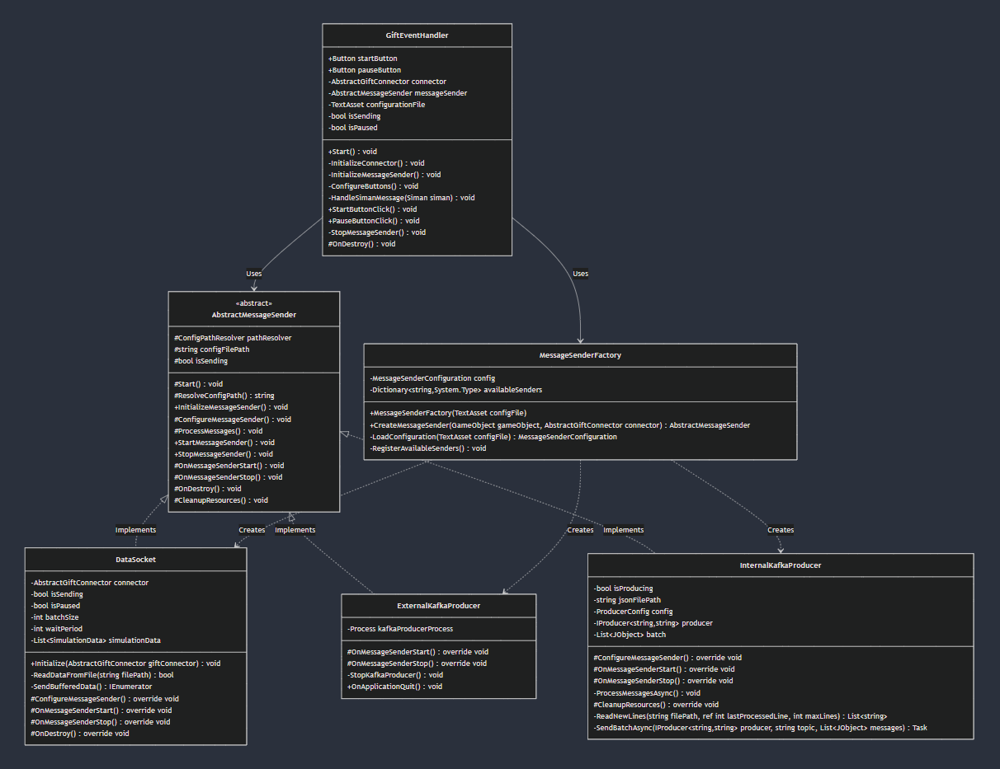

# Running Notes

## GIFT - Unity Communication

Currently, we are utilizing **a raw socket channel** for sending **control messages** from GIFT to Unity. This socket channel allows GIFT to send SIMAN control messages over to the unity environment and then receive acks for the same.

For receiving **data messages** sent from Unity to GIFT, we are using **Kafka**. Although we have a fully functional socket channel that could handle data communication, we have switched to Kafka for managing the data channel to better suit our messaging system's architecture and scalability.

---

## GIFT - Unity VR Integration Scenario

The expected setup for SteelARTT integration includes the following:

1. **Three Trainees with VR Headsets**: There will be three separate Unity instances, one for each trainee, each operating independently.
2. **One Unity Server**: These Unity instances will be connected to a single Unity server that manages their operations.
3. **One GIFT Server**: All trainees will be connected to a single GIFT server, with each trainee's Unity instance communicating with an instance of GIFT via the `<IP>:<port>` of the running GIFT instance on the host machine.

### Network Configuration:
- **Same Network Requirement**: All machines (Unity instances, Unity server, and GIFT server) must be on the same network. Otherwise, they will not be able to communicate with one another due to network access restrictions.

This setup ensures smooth communication between GIFT and Unity for each trainee in the VR environment while leveraging both socket and Kafka channels for control and data messages respectively.

### Oct 16 2024

**GIFT Side interop plugin design pattern:**

Currently for all the files in the [Steelartt interop plugin](https://github.com/kgary/GIFT-SVN/tree/better-build/GIFT/src/edu/asu/selab/steelartt/gateway/interop/Steelartt), we're using the below design patttern.

1) Firstly, we're using GIFT's provided abstract class [AbstractInteropInterface.java](https://github.com/kgary/GIFT-SVN/blob/better-build/GIFT/src/mil/arl/gift/gateway/interop/AbstractInteropInterface.java).

2) Next we've created [SteelArttInteropTemplate.java](https://github.com/kgary/GIFT-SVN/blob/better-build/GIFT/src/edu/asu/selab/steelartt/gateway/interop/Steelartt/SteelArttInteropTemplate.java), this has the basic functions overriden from AbstractInteropInterface, along with default implementations of the Raw Socket used for the control message channel(as that is not being changed for the forseeable future). This also has some  "template methods", that will me overridden by 2 other classes below.

3) Next, we've created [SteelArttSocket.java](https://github.com/kgary/GIFT-SVN/blob/better-build/GIFT/src/edu/asu/selab/steelartt/gateway/interop/Steelartt/SteelArttSocket.java), this has all the methods for the 2nd Raw socket channel(involving data messages). This also has the dataSocketHandler member variable initialized and used in various methods(some unique(local) and some overridden from SteelArttInteropTemplate).

4) Lastly, we've created [SteelArttKafka.java](https://github.com/kgary/GIFT-SVN/blob/better-build/GIFT/src/edu/asu/selab/steelartt/gateway/interop/Steelartt/SteelArttKafka.java), this has all the methods for the Kafka channel(involving data messages). This has the KafkaConsumer member variable and all other unique(local) methods for starting Kafka, stopping Kafka & consuming messages.

The class diagram for the above is here 

**Unity Side interop plugin design pattern**

1) [GiftEventHandler.cs](https://github.com/jvaida/STTC-XR-Multiplayer/blob/main/Unity-VR/unity-vr-app/Assets/GiftEventHandler/GiftEventHandler.cs)
Manages the overall flow of message handling and UI interactions. Uses MessageSenderFactory to create appropriate message sender instances. Handles SIMAN control messages (load, start, stop, pause, resume, restart) from GIFT and manages the complete lifecycle of message senders through UI button controls. Also controls message sender initialization and coordinates between UI interactions and message processing while managing GiftConnector initialization.

2) [AbstractMessageSender](https://github.com/jvaida/STTC-XR-Multiplayer/blob/main/Unity-VR/unity-vr-app/Assets/DataMessageHandler/AbstractMessageSender.cs)
Abstract base class that provides a template for message sending implementations. Manages the lifecycle of message senders including initialization, starting, stopping, and cleanup. Uses ConfigPathResolver to obtain configuration paths and maintains sending state.

3) [InternalKafkaProducer.cs](https://github.com/jvaida/STTC-XR-Multiplayer/blob/main/Unity-VR/unity-vr-app/Assets/DataMessageHandler/InternalKafkaProducer.cs)
Implements AbstractMessageSender for direct Kafka integration within Unity using Confluent.Kafka library. Configures and manages an internal Kafka producer that handles asynchronous message processing and batching. Reads and processes JSON data files while managing producer resources and batch processing with configurable parameters.

4) [ExternalKafkaProducer.cs](https://github.com/jvaida/STTC-XR-Multiplayer/blob/main/Unity-VR/unity-vr-app/Assets/DataMessageHandler/ExternalKafkaProducer.cs)
Implements AbstractMessageSender to manage an external Kafka producer process. Handles the complete lifecycle of an external process including startup, monitoring, and shutdown. Manages process coordination through configuration-based execution and ensures proper cleanup during application quit.

5) [DataSocket.cs](https://github.com/jvaida/STTC-XR-Multiplayer/blob/main/Unity-VR/unity-vr-app/Assets/DataMessageHandler/DataSocket.cs)
Implements AbstractMessageSender for socket-based communication with GIFT. Manages socket connections while handling batched data transmission with configurable batch sizes. Implements data buffering for efficient transmission through asynchronous sending mechanisms.

6) [MessageSenderFactory.cs](https://github.com/jvaida/STTC-XR-Multiplayer/blob/main/Unity-VR/unity-vr-app/Assets/GiftEventHandler/MessageSenderFactory.cs)
Creates and configures message sender instances based on configuration. Handles dynamic sender type registration and configuration-based creation while managing sender initialization. Provides type-safe sender instantiation and dependency injection for created instances.

The class diagram for this is here 

**Unity Side Config Reader**

1) [AbstractMessageSender](https://github.com/jvaida/STTC-XR-Multiplayer/blob/main/Unity-VR/unity-vr-app/Assets/DataMessageHandler/AbstractMessageSender.cs)
Abstract base class that provides a template for message sending implementations. Manages the lifecycle of message senders including initialization, starting, stopping, and cleanup. Uses ConfigPathResolver to obtain configuration paths and maintains sending state.

2) [ConfigPathResolver](https://github.com/jvaida/STTC-XR-Multiplayer/blob/main/Unity-VR/unity-vr-app/Assets/Config/ConfigPathResolver.cs)
Singleton class that resolves configuration file paths using config readers. Manages class-to-provider type mappings and coordinates with ConfigReaderFactory to obtain appropriate readers.

3) [AbstractConfigReader](https://github.com/jvaida/STTC-XR-Multiplayer/blob/main/Unity-VR/unity-vr-app/Assets/Config/AbstractConfigReader.cs)
Abstract base class for configuration readers. Manages XML document handling and defines the contract for path resolution. Provides shared XML parsing functionality through protected methods.

4) [InternalConfigReader](https://github.com/jvaida/STTC-XR-Multiplayer/blob/main/Unity-VR/unity-vr-app/Assets/Config/InternalConfigReader.cs)
Implementation of AbstractConfigReader for internal configurations. Overrides LoadConfig for internal-specific loading logic and implements GetFilePath<T> for internal path resolution.

5) [ExternalConfigReader](https://github.com/jvaida/STTC-XR-Multiplayer/blob/main/Unity-VR/unity-vr-app/Assets/Config/ExternalConfigReader.cs)
Implementation of AbstractConfigReader for external configurations. Overrides LoadConfig for external-specific loading logic and implements GetFilePath<T> for external path resolution.

6) [ConfigReaderFactory](https://github.com/jvaida/STTC-XR-Multiplayer/blob/main/Unity-VR/unity-vr-app/Assets/Config/ConfigReaderFactory.cs)
Static factory class that instantiates appropriate config reader (Internal/External) based on ConfigProviderType. Acts as a creation point for configuration readers.

The class diagram for this is here 

# Course Transition Order (GIFT Perspective)

Below, we've outlined the order of GIFT course transition as per Vipin's latest updates.

## Course Flow

1. **Knowledge PPT**
2. **Knowledge Check**
3. **Pre-Test**
4. **VR Scenario 1**
   - Preparation Brief
   - Scenario First Half(1.1)
   - After Action Review (also the break time)
   - Scenario Second Half(1.2)
   - After Action Review
5. **Post-Test for Knowledge 1**
6. **Post-Test 1**
7. **UX Survey**
8. **VR Scenario 2**
   - Preparation Brief
   - Scenario First Half(2.1)
   - After Action Review (also the break time)
   - Scenario Second Half(2.2)
   - After Action Review
9. **Post-Test for Knowledge 2**
10. **Post-Test 2**
