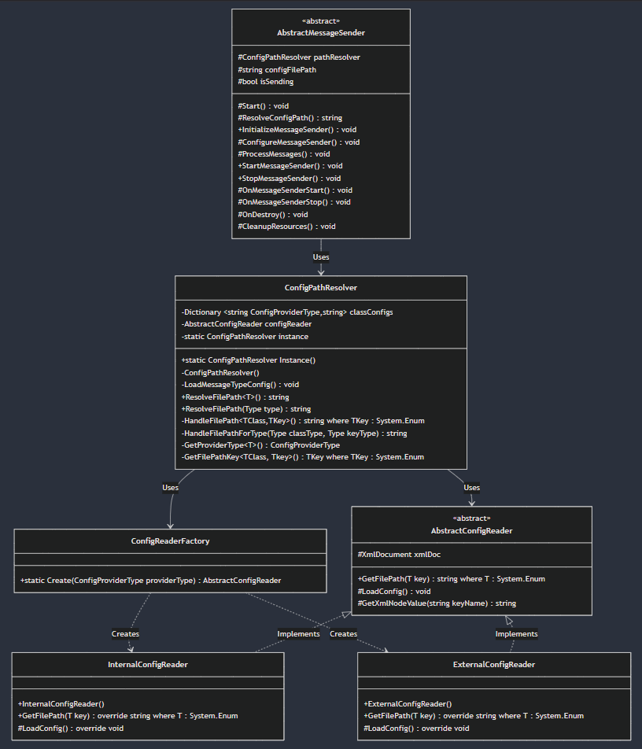

# Running Notes

## GIFT - Unity Communication

Currently, we are utilizing **a raw socket channel** for sending **control messages** from GIFT to Unity. This socket channel allows GIFT to send SIMAN control messages over to the unity environment and then receive acks for the same.

For receiving **data messages** sent from Unity to GIFT, we are using **Kafka**. Although we have a fully functional socket channel that could handle data communication, we have switched to Kafka for managing the data channel to better suit our messaging system's architecture and scalability.

---

## GIFT - Unity VR Integration Scenario

The expected setup for SteelARTT integration includes the following:

1. **Three Trainees with VR Headsets**: There will be three separate Unity instances, one for each trainee, each operating independently.
2. **One Unity Server**: These Unity instances will be connected to a single Unity server that manages their operations.
3. **One GIFT Server**: All trainees will be connected to a single GIFT server, with each trainee's Unity instance communicating with an instance of GIFT via the `<IP>:<port>` of the running GIFT instance on the host machine.

### Network Configuration:
- **Same Network Requirement**: All machines (Unity instances, Unity server, and GIFT server) must be on the same network. Otherwise, they will not be able to communicate with one another due to network access restrictions.

This setup ensures smooth communication between GIFT and Unity for each trainee in the VR environment while leveraging both socket and Kafka channels for control and data messages respectively.

### Oct 16 2024

**GIFT Side interop plugin design pattern:**

Currently for all the files in the [Steelartt interop plugin](https://github.com/kgary/GIFT-SVN/tree/better-build/GIFT/src/edu/asu/selab/steelartt/gateway/interop/Steelartt), we're using the below design patttern.

1) Firstly, we're using GIFT's provided abstract class [AbstractInteropInterface.java](https://github.com/kgary/GIFT-SVN/blob/better-build/GIFT/src/mil/arl/gift/gateway/interop/AbstractInteropInterface.java).

2) Next we've created [SteelArttInteropTemplate.java](https://github.com/kgary/GIFT-SVN/blob/better-build/GIFT/src/edu/asu/selab/steelartt/gateway/interop/Steelartt/SteelArttInteropTemplate.java), this has the basic functions overriden from AbstractInteropInterface, along with default implementations of the Raw Socket used for the control message channel(as that is not being changed for the forseeable future). This also has some  "template methods", that will me overridden by 2 other classes below.

3) Next, we've created [SteelArttSocket.java](https://github.com/kgary/GIFT-SVN/blob/better-build/GIFT/src/edu/asu/selab/steelartt/gateway/interop/Steelartt/SteelArttSocket.java), this has all the methods for the 2nd Raw socket channel(involving data messages). This also has the dataSocketHandler member variable initialized and used in various methods(some unique(local) and some overridden from SteelArttInteropTemplate).

4) Lastly, we've created [SteelArttKafka.java](https://github.com/kgary/GIFT-SVN/blob/better-build/GIFT/src/edu/asu/selab/steelartt/gateway/interop/Steelartt/SteelArttKafka.java), this has all the methods for the Kafka channel(involving data messages). This has the KafkaConsumer member variable and all other unique(local) methods for starting Kafka, stopping Kafka & consuming messages.

The class diagram for the above is here 

**Unity Side interop plugin design pattern**

1) We are using [GiftEventHandler.cs](https://github.com/kgary/steel-artt-unity-team-se/blob/unity-with-kafka-producer/unity-template/Assets/GiftEventHandler.cs), which manages connections by **sending acknowledgments (ACKs)** for each of the different SIMAN control messages received by GIFT (load, start, stop, pause, resume, restart). It also **provides methods to initialize, start, and stop different message-sender** types based on the currently selected one (InternalKafka, ExternalKafka, and DataSocket). The Start and Stop methods are triggered when the respective buttons are clicked.

2) In [InternalKafkaProducer.cs](https://github.com/kgary/steel-artt-unity-team-se/blob/unity-with-kafka-producer/unity-template/Assets/DataMessageHandler/InternalKafkaProducer.cs), we have integrated Kafka directly with Unity using the Confluent.Kafka library. It initializes **a Kafka producer that runs within Unity**, periodically reads new lines from a JSON file, batches the data, and sends it asynchronously to a specified Kafka topic. It also provides start/stop functionality for the production process. The file path for the JSON data is retrieved using `ConfigReader.cs`.

3) [ExternalKafkaProducer.cs](https://github.com/kgary/steel-artt-unity-team-se/blob/unity-with-kafka-producer/unity-template/Assets/DataMessageHandler/ExternalKafkaProducer.cs) manages an external Kafka producer process. It reads the path of **an external Kafka producer executable** from a configuration file using `ConfigReader.cs`. The Start method launches this external process when the script is initialized, and the Stop method terminates the external process when called or when the Unity application quits. This approach allows Unity to interact with a Kafka producer running as a separate process, rather than integrating Kafka directly into the Unity application.

4) In [DataSocket.cs](https://github.com/kgary/steel-artt-unity-team-se/blob/unity-with-kafka-producer/unity-template/Assets/DataMessageHandler/DataSocket.cs), Unity is integrated with a GIFT connector to send trainee data in batches. It reads data from a file, batches it according to a specified size, and sends it asynchronously **through a socket connection** to GIFT. The script provides functionality to start, pause, and resume sending data, with configurable batch size and delay between batches. The file path for the data file is retrieved using `ConfigReader.cs`, ensuring the system can dynamically access the correct file for processing.

5) In [ConfigReader.cs](https://github.com/kgary/steel-artt-unity-team-se/blob/unity-with-kafka-producer/unity-template/Assets/DataMessageHandler/ConfigReader.cs), a static method GetFilePath is provided to **read and extract file paths** from config.txt stored in Assets/Resources. The method loads the txt file, splits it into lines, and retrieves the line corresponding to a specified index. If the line contains a valid file path (prefixed with "FilePath="), it extracts and returns the path.

The class diagram for this is here 

**Unity Side Config Reader**

1) [ConfigPathResolver](https://github.com/kgary/steel-artt-unity-team-se/blob/unity-with-kafka-producer/unity-template/Assets/Config/ConfigPathResolver.cs)
Resolves file paths for different components by determining their provider type and handling path resolution through appropriate config readers. Acts as the main entry point for clients needing configuration paths.

2) [FilePathService](https://github.com/kgary/steel-artt-unity-team-se/blob/unity-with-kafka-producer/unity-template/Assets/Config/FilePathService.cs)
Manages the mapping between classes and their configuration data (provider types and file path keys). Loads configuration from MessageTypeConfig.xml and provides access to configuration settings through a centralized singleton instance.

3) [AbstractConfigReader](https://github.com/kgary/steel-artt-unity-team-se/blob/unity-with-kafka-producer/unity-template/Assets/Config/AbstractConfigReader.cs)
Abstract base class defining the contract for reading configuration files. Provides common XML handling functionality while allowing specific implementations to define how they load and retrieve file paths.

4) [InternalConfigReader](https://github.com/kgary/steel-artt-unity-team-se/blob/unity-with-kafka-producer/unity-template/Assets/Config/InternalConfigReader.cs)
Implementation of AbstractConfigReader for reading internalConfig.xml. Specifically handles paths defined by InternalFilePathKey enum, typically for internal system components.

5) [ExternalConfigReader](https://github.com/kgary/steel-artt-unity-team-se/blob/unity-with-kafka-producer/unity-template/Assets/Config/ExternalConfigReader.cs)
Implementation of AbstractConfigReader for reading externalConfig.xml. Manages paths defined by ExternalFilePathKey enum, typically for components that interact with external systems.

6) [ConfigReaderFactory](https://github.com/kgary/steel-artt-unity-team-se/blob/unity-with-kafka-producer/unity-template/Assets/Config/ConfigReaderFactory.cs)
Creates appropriate config reader instances based on the provider type. Centralizes the logic for instantiating different types of configuration readers (internal/external).

The class diagram for this is here 